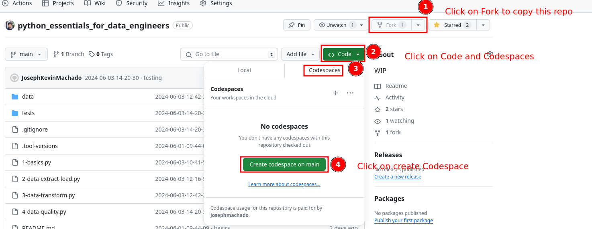

# Cost Effective Data Pipelines

Code for blog at: WIP

## Setup:

### Prerequisites:

1. [Python 3.8 or above](https://www.python.org/downloads/)
2. [sqlite3](https://www.sqlite.org/index.html)
3. Sufficient disk memory (depending on if you want to run with 1 or 10 or 100GB)

**Note**: all of this can run on GitHub codespaces: 

Lets create a virtual env and install the libraries needed:

```bash
python3 -m venv myenv
# windows
# myenv\Scripts\activate
# Linux
source myenv/bin/activate
pip install -r requirements.txt
# After you are done, deactivate with the command `deactivate`
```

### Generate data:

For the example in this repo we use the TPC-H data set and Coincap API.
Let's generate the TPCH data:

```bash
# NOTE: This is to clean up any data (if present) 
rm tpch-dbgen/*.tbl
# Generate data set of 1 GB size
cd tpch-dbgen
make
./dbgen -s 1 # Change this number to generate a data of desired size
cd ..

# NOTE: Load the generated data into a tpch sqlite3 db
sqlite3 tpch.db < ./upstream_db/tpch_DDL_DML.sql > /dev/null 2>&1
```

Let's open a sqlite3 shell and run a quick count check to ensure that the tables were loaded properly.

```sql
sqlite3 tpch.db
.read ./upstream_db/count_test.sql
/* 
Your output will be (if you generated a 1GB dataset)
150000
6001215
25
1500000
200000
800000
5
10000
*/
.exit  -- exit sqlite3
```

## Data processing

Run ETL with python as shown below

```bash
time python ./src/data_processor/exchange_data.py 2024-05-29
time python ./src/data_processor/dim_parts_supplier.py 2024-05-29
time python ./src/data_processor/one_big_table.py 2024-05-29
time python ./src/data_processor/wide_month_supplier_metrics.py 2024-05-29
#  1201.08s user 1020.04s system 398% cpu 9:17.08 total
# 9 minutes and 17s on a 10GB dataset
```

The output of the `one_big_table.py` script for a data of 10GB is

```bash
972.75s user 83.38s system 647% cpu 2:43.15 total
# The script was run on a 32GB RAM 8 core Thinkpad
```

**Explanation**:

1. **`user: 972.75s`**: is the amount of CPU time spent in user-mode (non-kernel) code. 
    In this case, the script spent 972.75 seconds executing user-mode instructions.
2. **`system: 83.38s`**: is the amount of CPU time spent in kernel-mode (system) code.
    The script spent 83.38 seconds executing system-level operations.
3. **`cpu: 647%`**: This percentage indicates the CPU utilization during the script execution.
    A value over 100% means that the process used multiple CPU cores.
    In this case, 647% suggests that, on average, more than six cores were utilized concurrently.
4. **`total: 2:43.15`**: This is the total elapsed (wall-clock) time taken to run the script.
    The format is minutes:seconds, so 2:43.15 translates to 2 minutes and 43.15 seconds.

**Summary**:
The script took 2 minutes and 43.15 seconds to run from start to finish.
During this time, it utilized a significant amount of CPU resources, with 972.75 seconds of user time and 83.38 seconds of system time, indicating efficient use of multiple CPU cores.

