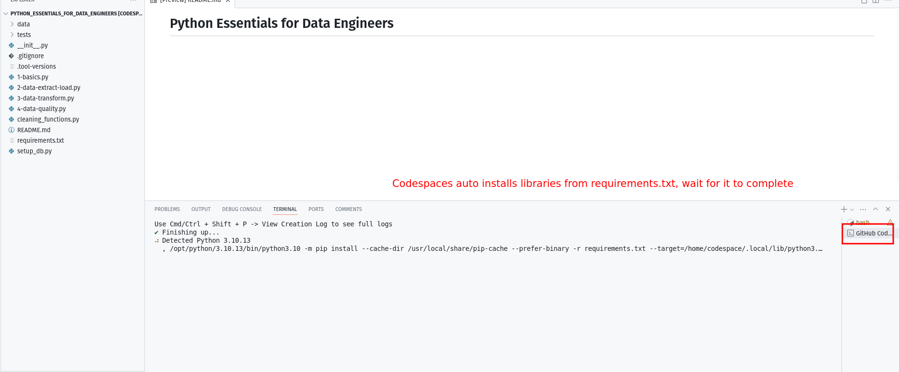

# Cost Effective Data Pipelines

Code for blog at: [Building cost effective data pipelines with Python & DuckDB](https://www.startdataengineering.com/post/cost-effective-pipelines/) 

## Setup:

### Run on CodeSpaces:

You can run the code in the repo with Codespaces. 

1. Fork this repo.
2. Click on code button and select the codespaces tab.
3. Click on the `Create codespace on main` button.


When codespaces open, wait for it to complete installing the required libraries from [./requirements.txt](./requirements.txt).



You can open a Python REPL and run the scripts in the generate date section.

### Run code on your machine:

You'll need the following:

1. [Python 3.8 or above](https://www.python.org/downloads/)
2. [sqlite3](https://www.sqlite.org/index.html)
3. Sufficient disk memory (depending on if you want to run with 1 or 10 or 100GB)


Clone the repo and create a virtual env and install the libraries needed:

```bash
git clone https://github.com/josephmachado/cost_effective_data_pipelines.git
cd cost_effective_data_pipelines

python3 -m venv myenv
# windows
# myenv\Scripts\activate
# Linux
source myenv/bin/activate
pip install -r requirements.txt
# After you are done, deactivate with the command `deactivate`
```

### Generate data:

For the example in this repo we use the TPC-H data set and Coincap API.
Let's generate the TPCH data, by running the following commands in your terminal:

```bash
# NOTE: This is to clean up any data (if present) 
rm tpch-dbgen/*.tbl
# Generate data set of 1 GB size
cd tpch-dbgen
make
./dbgen -s 1 # Change this number to generate a data of desired size
cd ..

# NOTE: Load the generated data into a tpch sqlite3 db
sqlite3 tpch.db < ./upstream_db/tpch_DDL_DML.sql > /dev/null 2>&1
```

Let's open a sqlite3 shell and run a quick count check to ensure that the tables were loaded properly.

```sql
sqlite3 tpch.db
.read ./upstream_db/count_test.sql
/* 
Your output will be (if you generated a 1GB dataset)
150000
6001215
25
1500000
200000
800000
5
10000
*/
.exit  -- exit sqlite3
```

## Data processing

You can run the ETL scripts as shown below.

```bash
time python ./src/data_processor/exchange_data.py 2024-05-29
time python ./src/data_processor/dim_parts_supplier.py 2024-05-29
time python ./src/data_processor/one_big_table.py 2024-05-29 # 2m 43s
time python ./src/data_processor/wide_month_supplier_metrics.py 2024-05-29 # 7m 20s
# This last script will fail on base CodeSpace VM, see here for powerful Codespace VMS: https://docs.github.com/en/codespaces/customizing-your-codespace/changing-the-machine-type-for-your-codespace?tool=webui
```

Running the ETL on a 8 core, 32 GB RAM, 1TB HDD 2017 Thinkpad with performs as shown below. The script [wide_month_supplier_metrics.py](./src/data_processor/wide_month_supplier_metrics.py) ran in 7m and 20s, this included reading in about 10GB of data, ineffectively processing it and writing it out.

Resource utilization:


**NOTE:** The code in this repo can be optimized following principles stated in [this performance guide](https://duckdb.org/docs/guides/performance/overview.html).
